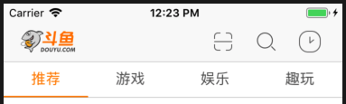
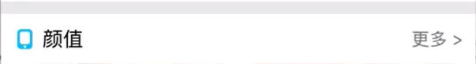

# 斗鱼直播 -- 适配 iOS10 以上

## 前言

这是一个网络课程，只是当时用的是适配iOS8.0版本，现在重新编译，让其适配iOS10.0以上的版本


## 详细内容

一.项目框架的搭建

* 在StoryBoard中添加TabBarView Controller，然后添加四个Embed了Navigation Controller的UIViewController，然后这四个  => Editor => Refactor to Storyboard，这样就把这些Navigation Controller 单独封装并放在相应的文件夹中

  > Note: IOS9.0之前，要在MainViewController中添加：
  >
  > ```swift
  >   override func viewDidLoad() {
  >         super.viewDidLoad()
  >         addChildVc(storyName: "Home") ===> Home.storyboard 
  >         addChildVc(storyName: "Live")
  >         addChildVc(storyName: "Follow")
  >         addChildVc(storyName: "Profile")
  >     }
  > 
  >   private func addChildVc(storyName:String){
  >         // 1. 通过storyboard获取控制器
  >         let childVc = UIStoryboard(name: storyName, bundle:nil).instantiateInitialViewController()!
  >         // 2. 将childVc作为子控制器
  >         addChild(childVc)
  >     }
  > ```
  >
  >

三. 封装**PageTitleView**以及**PageContentView**，处理**PageTitleView**和**PageContentView**的逻辑



1. 设置导航栏setupNavigationBar()



七. 封装网络请求


一些斗鱼API：

* 热门数据（热门游戏）：http://capi.douyucdn.cn/api/v1/getHotCate
* 请求参数：

| 参数名称    | 参数说明 |
| --------   | :----:   |
| time    | 获取当前时间的字符串 |
| limit   | 获取数据的个数 |
| offset  | 偏移的数据量 |


- 颜值数据：http://capi.douyucdn.cn/api/v1/getVerticalRoom
- 请求参数：

| 参数名称 |       参数说明       |
| -------- | :------------------: |
| time     | 获取当前时间的字符串 |
| limit    |    获取数据的个数    |
| offset   |     偏移的数据量     |

- 大数据数据：http://capi.douyucdn.cn/api/v1/getbigDataRoom
- 请求参数：

| 参数名称 |       参数说明       |
| -------- | :------------------: |
| time     | 获取当前时间的字符串 |
| limit    |    获取数据的个数    |
| offset   |     偏移的数据量     |